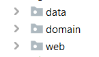

# 2.semLoginSample

## Http protocol is stateless
The web app illustrates the use of session object (WebRequest.SCOPE_SESSION) to hold user object after login/user registration. The Http protocol is by nature stateless, meaning that the web server does not keep session state from previous requests by the client (browser). This has a number of advantages:
<p>
Visibility is improved because a monitoring system does not have to look beyond a single request in order to determine its full nature. Reliability is improved because it eases the task of recovering from partial failures. Scalability is improved because not having to store session state between requests allows the server to quickly free resources and further simplifies implementation.

The disadvantage of stateless protocols is that they may decrease network performance by increasing the repetitive data sent in a series of requests, since that data cannot be left on the server and reused.
  </p> 
  [wiki](https://en.wikipedia.org/wiki/Stateless_protocol)

## Spring session object
<p>
Session object provides a way to identify a user across more than one page request and to store information about <i>that</i> user. The session object is automatically created by Spring Framework, but you must provide it with whatever data the app needs for a specific client. For instance user identification or items in a shopping cart in web shop.
<p>
Be careful not to store large and unnecessary object graphs to overburden the server. It impacts scalability.
  
 ## Logical architecture
  The app is build as a three layered architecture that follows this illustration https://martinfowler.com/bliki/PresentationDomainDataLayering.html:  
  
  
  The application has:
  
  - presentation layer consisting of @Controller in web package (C of MVC) and html pages (view in MVC) in resources/templates.
  - domain layer consisting of service class LoginService (aka GRASP controller handling a use cases) and domain class User.
  - data layer consisting of DataManager and UserRepository (interface and implementations). A repository mediates between the domain and data mapping layer.
  
  <p>The package naming looks like this (where service and domain model classes are in the same domain package):</p>
  
  
 
 <p> A service layer defines the application set of available operations from the perspective of client interface (presentation layyer). A MVC @Controller has a service class as its first contact point in the backend part of the application. 
   <br>The service layer encapsulates the application's business logic, it controls transactions and coordinates responses when an alternative use case scenario is encountered. It can be illustrated like this: </p>
 https://martinfowler.com/eaaCatalog/serviceLayer.html
 


## Exception handling

The application uses its own Exception type to avoid SQL Exceptions to propagate into other architectural layers.

```java
public class LoginSampleException extends Exception {

    public LoginSampleException(String msg) {
        super(msg);
    }
}
```

If an SQLException occurs in the repository class, it is tranformed into a user type exception:

```java
 catch (SQLException ex) {
     throw new LoginSampleException(ex.getMessage());
 }
 ```

In a Spring @Controller, the exception is is automatically caught and handled with @ExceptionHandler annotation:

```java
@ExceptionHandler(LoginSampleException.class)
    public String handleError(Model model, Exception exception) {
        model.addAttribute("message",exception.getMessage());
        return "exceptionPage";
    }
```

