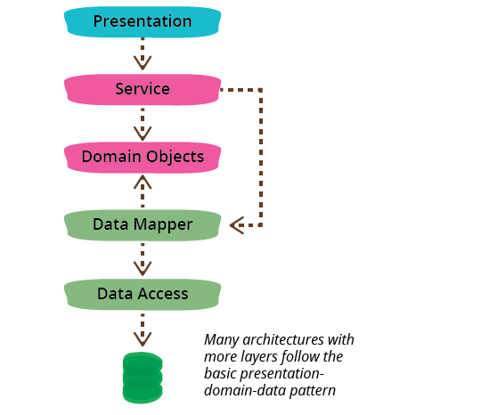

# 2.semLoginSample

The web app illustrates the use of session object (WebRequest.SCOPE_SESSION) to hold user object after login/user registration. The Http protocol is by nature stateless, meaning that the web server does not keep session state from previous requests by the client (browser). This has a number of advantages:

  Visibility is improved because a monitoring system does not have to look beyond a single request in order to determine its full nature. Reliability is improved because it eases the task of recovering from partial failures. Scalability is improved because not having to store session state between requests allows the server to quickly free resources and further simplifies implementation.

The disadvantage of stateless protocols is that they may decrease network performance by increasing the repetitive data sent in a series of requests, since that data cannot be left on the server and reused.
  
 
  - [Source; wiki](https://en.wikipedia.org/wiki/Stateless_protocol) om Git

bla

